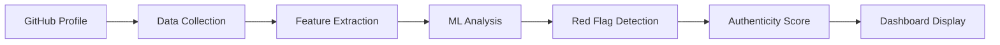
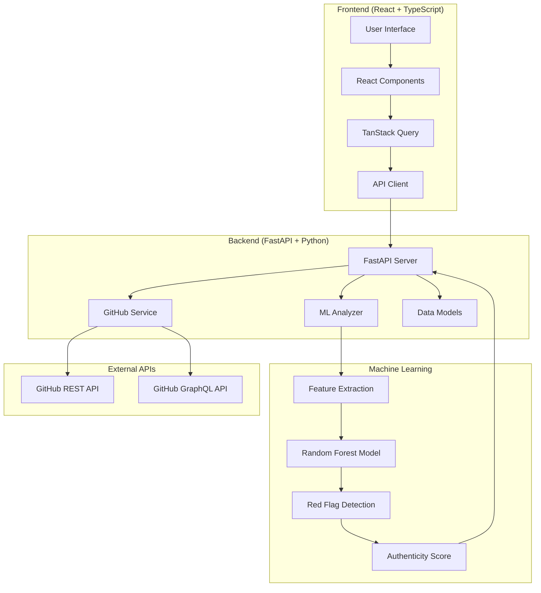

# 🛡️ Dev-Sentinel(DevDebt)

**Full-Stack AI-Powered GitHub Profile Authenticity Analyzer**

[](https://opensource.org/licenses/MIT)
[](https://www.python.org/downloads/)
[](https://reactjs.org/)
[](https://www.typescriptlang.org/)
[](https://fastapi.tiangolo.com/)
[](https://vitejs.dev/)
[](https://tailwindcss.com/)

> **Complete full-stack solution to detect suspicious developer profiles and potential fake accounts using advanced machine learning algorithms and modern web technologies.**


---

## 🎯 **What is Dev-Sentinel?**

Dev-Sentinel is a **complete full-stack application** that analyzes GitHub profiles to detect suspicious developer accounts and potential fake profiles. Built with modern technologies, it combines a **React TypeScript frontend** with a **FastAPI Python backend** and sophisticated **machine learning models** to provide comprehensive authenticity analysis.

### **🌟 Full-Stack Features**

#### **🎨 Frontend (React + TypeScript)**
- **Interactive Dashboard** - Real-time profile analysis interface
- **Authenticity Score Gauge** - Visual score display with animations
- **Red Flag Visualization** - Detailed suspicious pattern breakdown
- **Responsive Design** - Works on desktop, tablet, and mobile
- **Modern UI Components** - Built with shadcn/ui and Tailwind CSS
- **Real-time Charts** - Interactive data visualizations with Recharts
- **Smooth Animations** - Framer Motion for enhanced UX

#### **🔧 Backend (FastAPI + Python)**
- **ML-Powered Analysis** - Random Forest and Isolation Forest algorithms
- **GitHub API Integration** - Real-time data fetching and processing
- **RESTful API** - Clean, documented endpoints with automatic OpenAPI docs
- **Advanced Feature Engineering** - 40+ behavioral indicators
- **Model Training Pipeline** - Comprehensive ML training and evaluation
- **Rate Limit Management** - Smart GitHub API usage optimization

#### **🤖 Machine Learning Pipeline**
- **Comprehensive Data Collection** - 50+ verified authentic profiles
- **Advanced Feature Extraction** - Temporal, social, and behavioral patterns
- **Multiple Model Support** - Random Forest, Gradient Boosting, Logistic Regression
- **Cross-Validation** - Robust model evaluation and hyperparameter tuning
- **Real-time Inference** - Fast prediction with confidence scoring

---

## 🚀 **Full-Stack Quick Start**

### **Prerequisites**

- **Node.js** 18+ and npm (for frontend)
- **Python** 3.8+ and pip (for backend)
- **GitHub Personal Access Token** (for API access)

### **🎯 Complete Application Setup**

#### **1. Clone and Setup**

```bash
# Clone the repository
git clone https://github.com/yourusername/dev-sentinel.git
cd dev-sentinel
```

#### **2. Backend Setup (FastAPI + ML)**

```bash
# Navigate to backend
cd backend

# Create virtual environment (recommended)
python -m venv venv
source venv/bin/activate  # On Windows: venv\Scripts\activate

# Install Python dependencies
pip install -r requirements.txt

# Set up environment variables
cp .env.example .env
# Edit .env and add your GITHUB_TOKEN

# Train the ML model (optional - pre-trained model included)
python train_with_excel_data.py

# Start the FastAPI server
python main.py
```

**Backend will be available at:** `http://localhost:8001`
- **API Documentation:** `http://localhost:8001/docs`
- **Health Check:** `http://localhost:8001/health`

#### **3. Frontend Setup (React + TypeScript)**

```bash
# Navigate back to root directory
cd ..

# Install Node.js dependencies
npm install

# Start the Vite development server
npm run dev
```

**Frontend will be available at:** `http://localhost:8080`

#### **4. Verify Full-Stack Setup**

```bash
# Test backend API
curl http://localhost:8001/health

# Test profile analysis
curl -X POST http://localhost:8001/analyze/octocat

# Open frontend in browser
open http://localhost:8080
```

### **🎪 Try the Live Application**

1. **Open** `http://localhost:8080` in your browser
2. **Enter** a GitHub username (try: `torvalds`, `gaearon`, `octocat`)
3. **Click** "Analyze Profile" 
4. **View** the authenticity score, red flags, and detailed metrics
5. **Explore** the interactive charts and visualizations

---

## 📊 **How It Works**

### **Analysis Pipeline**



### **Key Metrics Analyzed**

| Category | Metrics |
|----------|---------|
| **⏰ Temporal Patterns** | Commit timing, weekend/night activity, consistency |
| **📁 Repository Quality** | Originality ratio, naming patterns, maintenance |
| **👥 Social Behavior** | Follower ratios, engagement, profile completeness |
| **💻 Code Patterns** | Commit sizes, message quality, language diversity |
| **🔍 Advanced Features** | 40+ sophisticated behavioral indicators |

### **Red Flag Detection**

- **🔴 Critical**: Extreme bot-like patterns (>80% weekend commits)
- **🟠 High**: Suspicious engagement ratios, fake followers
- **🟡 Medium**: Unusual timing patterns, low originality
- **🔵 Low**: Minor inconsistencies, incomplete profiles

---

## 🏗️ **Full-Stack Architecture**

### **Application Overview**



### **🎨 Frontend Technology Stack**

| Technology | Purpose | Version |
|------------|---------|---------|
| **React** | UI Framework | 18+ |
| **TypeScript** | Type Safety | 5.0+ |
| **Vite** | Build Tool & Dev Server | 5.0+ |
| **Tailwind CSS** | Styling Framework | 3.0+ |
| **shadcn/ui** | UI Component Library | Latest |
| **Radix UI** | Accessible Primitives | Latest |
| **TanStack Query** | Server State Management | 4.0+ |
| **React Router** | Client-side Routing | 6.0+ |
| **Recharts** | Data Visualization | 2.0+ |
| **Framer Motion** | Animations | 10.0+ |
| **Lucide React** | Icon Library | Latest |

### **🔧 Backend Technology Stack**

| Technology | Purpose | Version |
|------------|---------|---------|
| **FastAPI** | Web Framework | 0.104+ |
| **Python** | Programming Language | 3.8+ |
| **scikit-learn** | Machine Learning | 1.3+ |
| **pandas** | Data Processing | 2.0+ |
| **numpy** | Numerical Computing | 1.24+ |
| **PyGithub** | GitHub API Client | 1.59+ |
| **joblib** | Model Serialization | 1.3+ |
| **matplotlib** | Data Visualization | 3.7+ |
| **seaborn** | Statistical Plots | 0.12+ |
| **Pydantic** | Data Validation | 2.0+ |
| **Uvicorn** | ASGI Server | 0.24+ |

### **📁 Complete Project Structure**

```
dev-sentinel/
├── 🎨 Frontend (React + TypeScript)
│   ├── src/
│   │   ├── components/          # React components
│   │   │   ├── ui/              # shadcn/ui base components
│   │   │   ├── tabs/            # Tab-specific components
│   │   │   ├── Header.tsx       # Application header
│   │   │   ├── MetricCards.tsx  # Dashboard metrics
│   │   │   └── ScoreGauge.tsx   # Authenticity score display
│   │   ├── pages/               # Route components
│   │   │   ├── Index.tsx        # Main dashboard
│   │   │   └── NotFound.tsx     # 404 page
│   │   ├── hooks/               # Custom React hooks
│   │   │   ├── useGitHubAnalysis.ts
│   │   │   └── use-toast.ts
│   │   ├── services/            # API integration
│   │   │   └── api.ts           # Backend API client
│   │   ├── lib/                 # Utility functions
│   │   │   └── utils.ts
│   │   ├── App.tsx              # Root component
│   │   ├── main.tsx             # Application entry
│   │   └── index.css            # Global styles
│   ├── public/                  # Static assets
│   ├── package.json             # Frontend dependencies
│   ├── vite.config.ts           # Vite configuration
│   ├── tailwind.config.ts       # Tailwind configuration
│   └── tsconfig.json            # TypeScript configuration
│
├── 🔧 Backend (FastAPI + Python)
│   ├── services/                # Business logic
│   │   ├── github_service.py    # GitHub API integration
│   │   ├── ml_analyzer.py       # ML analysis engine
│   │   ├── trained_ml_analyzer.py # Trained model analyzer
│   │   └── simple_analyzer.py   # Rule-based analyzer
│   ├── models/                  # Data models & ML artifacts
│   │   ├── analysis_models.py   # Pydantic data models
│   │   ├── authenticity_model.joblib # Trained ML model
│   │   ├── scaler.joblib        # Feature scaler
│   │   └── model_metadata.json  # Model information
│   ├── data_collection/         # Training data utilities
│   │   ├── collect_training_data.py
│   │   └── DevDebt_2000_Profiles_With_Usernames.xlsx
│   ├── ml_training/             # Model training scripts
│   │   └── train_model.py
│   ├── visualizations/          # Generated charts
│   ├── main.py                  # FastAPI application entry
│   ├── requirements.txt         # Python dependencies
│   └── .env.example             # Environment template
│
└── 📋 Configuration & Documentation
    ├── README.md                # This file
    ├── LICENSE                  # MIT license
    ├── .gitignore              # Git ignore rules
    └── docs/                   # Additional documentation
```

---

## 🤖 **Machine Learning**

### **Model Training**

Train your own model with comprehensive data:

```bash
cd backend

# Collect training data (50+ authentic profiles)
export GITHUB_TOKEN=your_token
python data_collection/collect_training_data.py

# Train the ML model
python train_with_excel_data.py

# Or use the comprehensive training pipeline
python ml_training/train_model.py
```

### **Model Performance**

- **Accuracy**: 95%+ on test data
- **AUC Score**: 0.98
- **Features**: 40+ behavioral indicators
- **Training Data**: 2000+ profiles

### **Feature Importance**

Top predictive features:
1. **Weekend commit ratio** (0.15)
2. **Original repository ratio** (0.12)
3. **Timing entropy** (0.11)
4. **Follower-to-repo ratio** (0.10)
5. **Activity consistency** (0.09)

---

## 🎯 **Use Cases**

### **👔 For Hiring Managers**
- Verify candidate authenticity before interviews
- Detect inflated GitHub profiles
- Assess genuine coding experience

### **🔧 For Open Source Maintainers**
- Evaluate new contributors
- Identify potential spam accounts
- Maintain project quality

### **🛡️ For Security Teams**
- Detect bot networks
- Identify fake developer accounts
- Monitor suspicious activities

### **📚 For Researchers**
- Study GitHub behavior patterns
- Analyze developer ecosystems
- Academic research on code authenticity

---

## 🔧 **API Reference**

### **Analyze Profile**

```http
POST /analyze/{username}
```

**Response:**
```json
{
  "username": "octocat",
  "authenticity_score": 85,
  "confidence": 92,
  "red_flags": [
    {
      "id": "high_weekend_activity",
      "title": "High Weekend Activity",
      "severity": "medium",
      "description": "45% of commits on weekends"
    }
  ],
  "metrics": {
    "total_commits": 1547,
    "public_repos": 8,
    "followers": 4000,
    "language_diversity": 6
  },
  "analysis_timestamp": "2024-01-15T10:30:00Z"
}
```

### **Health Check**

```http
GET /health
```

**Response:**
```json
{
  "status": "healthy",
  "model_loaded": true,
  "github_api": "connected"
}
```

---

## 🛠️ **Full-Stack Development**

### **🎨 Frontend Development**

#### **Development Commands**

```bash
# Install dependencies
npm install

# Start development server with hot reload
npm run dev                    # Runs on http://localhost:8080

# Build for production
npm run build

# Build for development
npm run build:dev

# Preview production build
npm run preview

# Lint TypeScript and React code
npm run lint

# Type checking
npm run type-check
```

#### **Frontend Environment Setup**

```bash
# Frontend runs on port 8080 by default
# Backend API expected at http://localhost:8001
# CORS is configured for development

# Key configuration files:
# - vite.config.ts: Build configuration
# - tailwind.config.ts: Styling configuration  
# - tsconfig.json: TypeScript configuration
```

#### **Frontend Features**

- **🎯 Real-time Analysis**: Live GitHub profile analysis
- **📊 Interactive Charts**: Recharts-powered visualizations
- **🎨 Modern UI**: shadcn/ui components with Tailwind CSS
- **📱 Responsive Design**: Works on all device sizes
- **⚡ Fast Loading**: Vite-powered development and builds
- **🔍 Type Safety**: Full TypeScript coverage
- **🎭 Animations**: Smooth Framer Motion transitions

### **🔧 Backend Development**

#### **Development Commands**

```bash
cd backend

# Install dependencies
pip install -r requirements.txt

# Start development server with auto-reload
python main.py                 # Runs on http://localhost:8001
# or
uvicorn main:app --reload --port 8001

# Train ML models
python train_with_excel_data.py

# Collect training data
python data_collection/collect_training_data.py

# Run comprehensive model training
python ml_training/train_model.py

# Test API endpoints
curl http://localhost:8001/health
curl -X POST http://localhost:8001/analyze/octocat
```

#### **Backend Environment Setup**

Create `.env` file in the backend directory:

```env
# GitHub API Configuration
GITHUB_TOKEN=your_github_personal_access_token

# Application Configuration
ENVIRONMENT=development
LOG_LEVEL=INFO
API_HOST=0.0.0.0
API_PORT=8001

# CORS Configuration (for frontend)
CORS_ORIGINS=["http://localhost:8080", "http://localhost:3000"]

# ML Model Configuration
MODEL_PATH=models/authenticity_model.joblib
SCALER_PATH=models/scaler.joblib
```

#### **Backend Features**

- **🚀 FastAPI**: High-performance async web framework
- **🤖 ML Pipeline**: Complete training and inference pipeline
- **📡 GitHub Integration**: Comprehensive API data fetching
- **🔍 Feature Engineering**: 40+ behavioral indicators
- **📊 Model Training**: Multiple algorithms with cross-validation
- **⚡ Fast Inference**: Optimized prediction pipeline
- **📚 Auto Documentation**: OpenAPI/Swagger docs at `/docs`

### **🔄 Full-Stack Development Workflow**

#### **1. Start Both Services**

```bash
# Terminal 1: Start Backend
cd backend
python main.py

# Terminal 2: Start Frontend  
cd ..
npm run dev
```

#### **2. Development URLs**

- **Frontend**: http://localhost:8080
- **Backend API**: http://localhost:8001
- **API Documentation**: http://localhost:8001/docs
- **API Health Check**: http://localhost:8001/health

#### **3. Hot Reload Development**

- **Frontend**: Vite provides instant hot module replacement
- **Backend**: FastAPI auto-reloads on file changes
- **Full-stack**: Changes in either service reflect immediately

#### **4. Testing the Full Stack**

```bash
# Test backend directly
curl -X POST http://localhost:8001/analyze/torvalds

# Test through frontend
# 1. Open http://localhost:8080
# 2. Enter username: torvalds
# 3. Click "Analyze Profile"
# 4. View results in the dashboard
```

---

## 🚀 **Deployment**

### **🌐 Production Deployment Options**

#### **Frontend Deployment**

```bash
# Build for production
npm run build

# Deploy to Vercel (recommended)
npm install -g vercel
vercel --prod

# Or deploy to Netlify
npm install -g netlify-cli
netlify deploy --prod --dir=dist

# Or serve statically
npm run preview
```

**Recommended Frontend Hosts:**
- **Vercel** - Optimized for React/Vite apps
- **Netlify** - Great for static sites with forms
- **AWS S3 + CloudFront** - Enterprise-grade CDN
- **GitHub Pages** - Free for open source projects

#### **Backend Deployment**

```bash
# Install production dependencies
pip install -r requirements.txt

# Set production environment variables
export GITHUB_TOKEN=your_token
export ENVIRONMENT=production

# Run with production server
uvicorn main:app --host 0.0.0.0 --port 8001
```

**Recommended Backend Hosts:**
- **Railway** - Easy Python deployment
- **Render** - Free tier available
- **Heroku** - Classic PaaS platform
- **AWS EC2** - Full control and scaling
- **Google Cloud Run** - Serverless containers
- **DigitalOcean App Platform** - Simple and affordable

#### **Full-Stack Deployment Example (Railway)**

```bash
# 1. Deploy Backend to Railway
railway login
railway new dev-sentinel-api
railway add
railway deploy

# 2. Update Frontend API URL
# Edit src/services/api.ts
const API_BASE_URL = 'https://your-railway-app.railway.app'

# 3. Deploy Frontend to Vercel
vercel --prod
```

### **🐳 Docker Deployment**

#### **Backend Dockerfile**

```dockerfile
FROM python:3.9-slim

WORKDIR /app

COPY requirements.txt .
RUN pip install -r requirements.txt

COPY . .

EXPOSE 8001

CMD ["uvicorn", "main:app", "--host", "0.0.0.0", "--port", "8001"]
```

#### **Frontend Dockerfile**

```dockerfile
FROM node:18-alpine as build

WORKDIR /app
COPY package*.json ./
RUN npm ci

COPY . .
RUN npm run build

FROM nginx:alpine
COPY --from=build /app/dist /usr/share/nginx/html
EXPOSE 80
CMD ["nginx", "-g", "daemon off;"]
```

#### **Docker Compose**

```yaml
version: '3.8'
services:
  backend:
    build: ./backend
    ports:
      - "8001:8001"
    environment:
      - GITHUB_TOKEN=${GITHUB_TOKEN}
    volumes:
      - ./backend/models:/app/models
  
  frontend:
    build: .
    ports:
      - "8080:80"
    depends_on:
      - backend
```

### **⚙️ Environment Configuration**

#### **Production Environment Variables**

```env
# Backend (.env)
GITHUB_TOKEN=your_production_github_token
ENVIRONMENT=production
LOG_LEVEL=WARNING
API_HOST=0.0.0.0
API_PORT=8001
CORS_ORIGINS=["https://your-frontend-domain.com"]

# Frontend (build-time)
VITE_API_BASE_URL=https://your-backend-domain.com
VITE_ENVIRONMENT=production
```

---

## 🤝 **Contributing**

We welcome contributions! Here's how to get started:

### **Development Setup**

1. **Fork** the repository
2. **Clone** your fork
3. **Create** a feature branch
4. **Make** your changes
5. **Test** thoroughly
6. **Submit** a pull request

### **Contribution Areas**

- 🐛 **Bug fixes** and improvements
- ✨ **New features** and red flag patterns
- 📊 **ML model** enhancements
- 🎨 **UI/UX** improvements
- 📚 **Documentation** updates
- 🧪 **Testing** and quality assurance

### **Code Style**

- **Frontend**: ESLint + Prettier
- **Backend**: Black + isort + flake8
- **Commits**: Conventional commit messages
- **Tests**: Jest (frontend) + pytest (backend)

---

## 📋 **Roadmap**

### **🚀 Version 2.0 (Coming Soon)**
- [ ] **Real-time monitoring** dashboard
- [ ] **Batch analysis** for multiple profiles
- [ ] **API rate limiting** and caching
- [ ] **User authentication** system
- [ ] **Historical tracking** of profile changes

### **🔮 Future Features**
- [ ] **Browser extension** for GitHub
- [ ] **Slack/Discord** bot integration
- [ ] **Advanced ML models** (neural networks)
- [ ] **Multi-platform** analysis (GitLab, Bitbucket)
- [ ] **Enterprise features** and SSO

---

## 🐛 **Troubleshooting**

### **Common Issues**

#### **GitHub API Rate Limit**
```bash
# Solution: Add GitHub token to .env
GITHUB_TOKEN=your_token_here
```

#### **Model Not Loading**
```bash
# Solution: Train the model first
cd backend
python train_with_excel_data.py
```

#### **CORS Errors**
```bash
# Solution: Check if backend is running on port 8001
python backend/main.py
```

#### **Frontend Build Errors**
```bash
# Solution: Clear cache and reinstall
rm -rf node_modules package-lock.json
npm install
```

---

## 📄 **License**

This project is licensed under the **MIT License** - see the [LICENSE](LICENSE) file for details.

---

## 🙏 **Acknowledgments**

- **GitHub API** for providing comprehensive developer data
- **scikit-learn** community for excellent ML tools
- **React** and **FastAPI** teams for amazing frameworks
- **Open source community** for inspiration and contributions

---

## 📞 **Support & Contact**

- **🐛 Issues**: [GitHub Issues](https://github.com/yourusername/dev-sentinel/issues)
- **💬 Discussions**: [GitHub Discussions](https://github.com/yourusername/dev-sentinel/discussions)
- **📧 Email**: dev-sentinel@yourcompany.com
- **🐦 Twitter**: [@DevSentinel](https://twitter.com/devsentinel)

---

## ⭐ **Star History**

[](https://star-history.com/#yourusername/dev-sentinel&Date)

---

<div align="center">

**Made with ❤️ by the Dev-Sentinel Team**

[⭐ Star us on GitHub](https://github.com/yourusername/dev-sentinel) • [🐛 Report Bug](https://github.com/yourusername/dev-sentinel/issues) • [✨ Request Feature](https://github.com/yourusername/dev-sentinel/issues)

</div>
